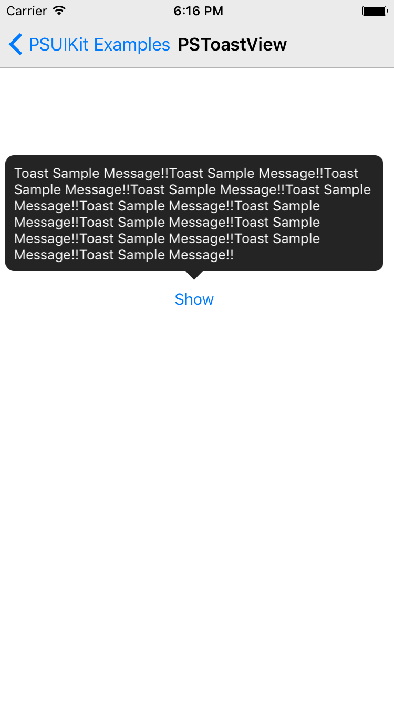

# PSUIKit

PSUIKit is a framework that helps you easily create iOS apps and change the design style. And has many useful components and classes.

[](https://travis-ci.org/Steve Kim/PSUIKit)
[](http://cocoapods.org/pods/PSUIKit)
[](http://cocoapods.org/pods/PSUIKit)
[](http://cocoapods.org/pods/PSUIKit)

## Feature
- Provides an easy way to create a custom component
- Themes provide the navigation bar that helps you easily change the style
- Frequently used components provided in the application

## Demo Application
<p valign="top">


</p>

## Example

To run the example project, clone the repo, and run `pod install` from the Example directory first.

### Changing the navigation bar style with a theme
<p valign="top">


</p>

- To implement applications using the global theme
```objective-c
- (BOOL)application:(UIApplication *)application didFinishLaunchingWithOptions:(NSDictionary *)launchOptions {
    [UIApplication sharedApplication].theme = [[UIThemeDefaultStyle alloc] init];
    
    return YES;
}
```

- To implement applications using the instance theme
```objective-c
UIViewController *controller = [[UIViewController alloc] init];
    
UINavigationController *navigationController = [[PSNavigationController alloc] initWithRootViewController:controller];
navigationController.theme = [[UIThemeDefaultStyle alloc] init];
    
[self presentViewController:navigationController animated:NO completion:nil];
```

- Implementation custom theme
```objective-c
#import "CustomTheme.h"

@implementation CustomTheme

- (UIColor *)navigationBarBarTintColor {
    return [UIColor brownColor];
}

- (UIColor *)navigationBarTintColor {
    return [UIColor yellowColor];
}

- (NSDictionary *)navigationBarTitleTextAttributes {
    return @{UITextAttributeFont: [UIFont boldSystemFontOfSize:18], UITextAttributeTextColor: [UIColor blackColor]};
}

@end
```

### To implement custom components with PSUIKit

### Using a valuable component of PSUIKit

##### PSAlertView
> By design , such as the UIAlertView to help put a different view on the inside.

<p valign="top">

</p>
```objective-c
- (void)testPSAlertView {
    [PSAlertView alertViewWithTitle:@"Title Sample" message:@"Message Sample!!" cancelButtonTitle:@"ok" dismission:nil otherButtonTitles:nil, nil];
}

- (void)testPSAlertViewWithCustomContentView {
    UITableView *tableView = [[UITableView alloc] initWithFrame:CGRectMake(0, 0, 320, 100)];
    tableView.dataSource = self;
    tableView.delegate = self;
    
    [PSAlertView alertViewWithContentView:tableView cancelButtonTitle:@"ok" dismission:nil otherButtonTitles:nil, nil];
}
```

##### PSAttributedDivisionLabel
> Labels with various font styles

<p valign="top">

</p>
```objective-c
- (void)testPSAttributedDivisionLabel {
    PSAttributedDivisionLabel *label = [[PSAttributedDivisionLabel alloc] init];
    label.divider = @"\n";
    label.colors = @[[UIColor redColor], [UIColor blueColor], [UIColor greenColor]];
    label.fonts = @[[UIFont systemFontOfSize:12], [UIFont systemFontOfSize:14], [UIFont systemFontOfSize:16]];
    label.text = @"redColor\nblueColor\ngreenColor";
    
    [self.view addSubview:label];
    [label sizeToFit];
}
```

##### PSBadge
> Badge that may be applied to the image background

<p valign="top">

</p>
```objective-c
- (void)testPSBadge {
    UIView *sourceView = [[UIView alloc] initWithFrame:CGRectMake(0, 0, 28, 28)];
    sourceView.layer.cornerRadius = sourceView.width/2;
    sourceView.backgroundColor = [UIColor redColor];
    
    PSBadge *badge = [[PSBadge alloc] initWithBackgroundImage:sourceView.image maxSize:CGSizeMake(100, sourceView.height) minSize:sourceView.size padding:CGPaddingMake(3, 3, 3, 3)];
    badge.text = @"7";
    badge.textLabel.textColor = [UIColor whiteColor];
    badge.origin = CGPointMake(self.xOffset, self.yOffset);
    
    [self.view addSubview:badge];
}
```

##### PSButtonBar

<p valign="top">

</p>
```objective-c
- (void)testPSButtonBar {
    PSButtonBar *buttonBar = [[PSButtonBar alloc] initWithFrame:CGRectMake(0, self.yOffset, self.view.width, 60)];
    buttonBar.numOfButtons = 3;
    buttonBar.seperatorColor = [UIColor whiteColor];
    
    buttonBar.delegateObject = [[PSButtonBarDelegateObject alloc] initWithRender:^(UIButton *button, NSUInteger buttonIndex) {
        [button setBackgroundImage:[[UIView alloc] initWithColor:[UIColor lightGrayColor] withFrame:button.bounds].image forState:UIControlStateNormal];
        [button setTitle:[NSString stringWithFormat:@"Button%tu", (buttonIndex+1)] forState:UIControlStateNormal];
        [button setTitleColor:[UIColor whiteColor] forState:UIControlStateNormal];
    } clicked:^(UIButton *button, NSUInteger buttonIndex) {
        NSLog(@"buttonBar clicked: buttonIndex -> %tu", buttonIndex);
    } resized:^(UIButton *button, NSUInteger buttonIndex) {
        NSLog(@"buttonBar resized: buttonIndex -> %tu", buttonIndex);
    } selected:^(UIButton *button, NSUInteger buttonIndex) {
        NSLog(@"buttonBar selected: buttonIndex -> %tu", buttonIndex);
    }];
    
    [self.view addSubview:buttonBar];
} 
```

##### PSPreloader

<p valign="top">

</p>
```objective-c
- (void)testPSPreloader {
    [[PSPreloader sharedInstance] show];
    
    dispatch_after(dispatch_time(DISPATCH_TIME_NOW, (int64_t)(2 * NSEC_PER_SEC)), dispatch_get_main_queue(), ^{
        [[PSPreloader sharedInstance] hideWithStatus:PSPreloaderStatusCompletion completion:nil];
    });
}
```

##### PSToastView

<p valign="top">

</p>
```objective-c
- (void)testPSToastView {
    PSToastView *toastView = [[PSToastView alloc] init];

    [toastView showInView:self.view message:@"Toast Sample Message!!"];
}
```

##### PSGridView
##### PSLinedBackgroundView

## Requirements
iOS Deployment Target 7.0 higher

## Installation

PSUIKit is available through [CocoaPods](http://cocoapods.org). To install
it, simply add the following line to your Podfile:

```ruby
pod "PSUIKit"
```

## Showcase
<p valign="top">


</p>

## Author

Steve Kim, hh963103@gmail.com

## License

PSUIKit is available under the MIT license. See the LICENSE file for more info.
